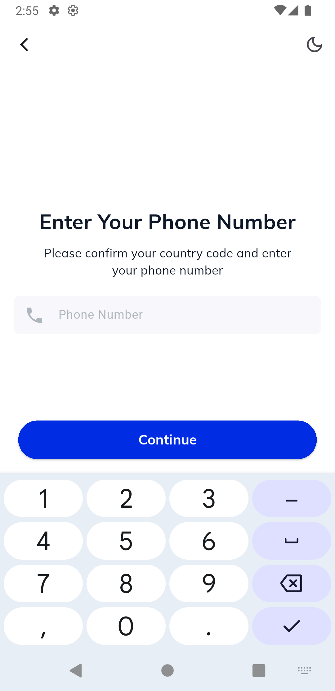
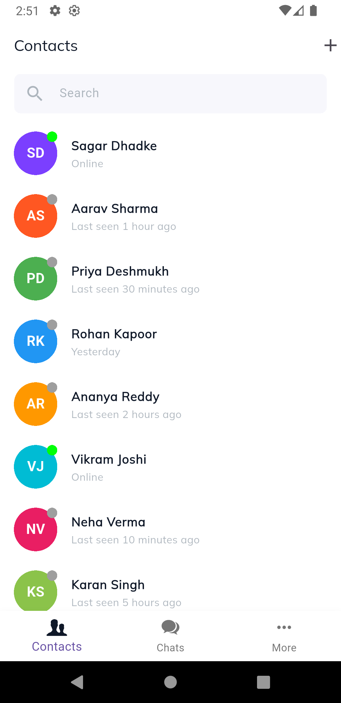
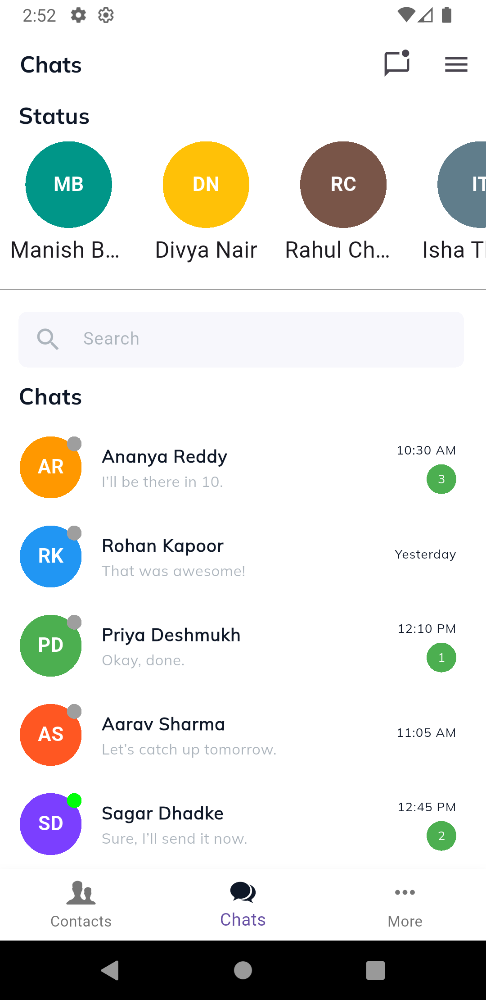
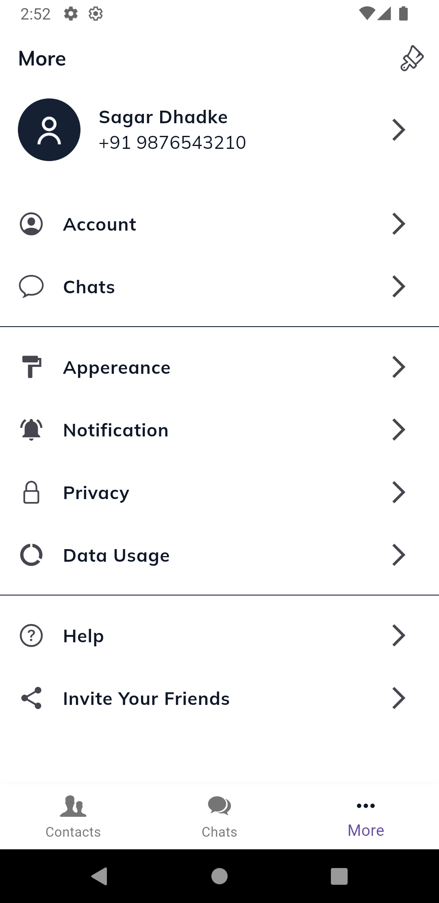
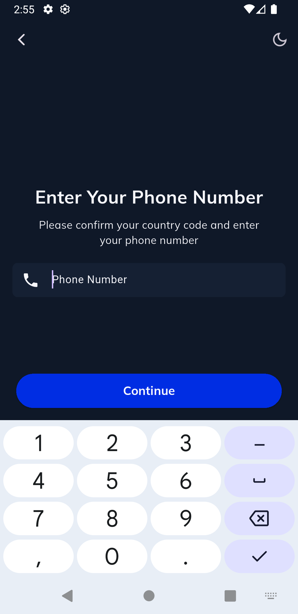
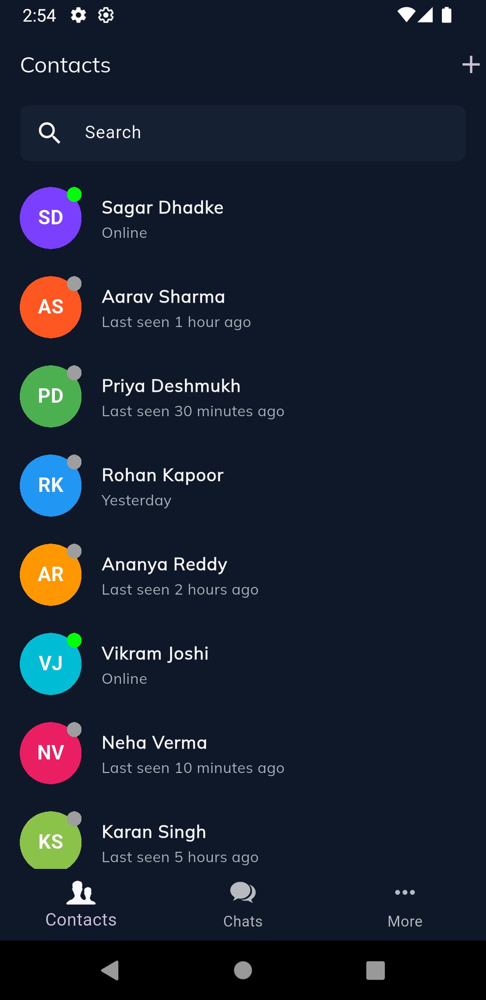
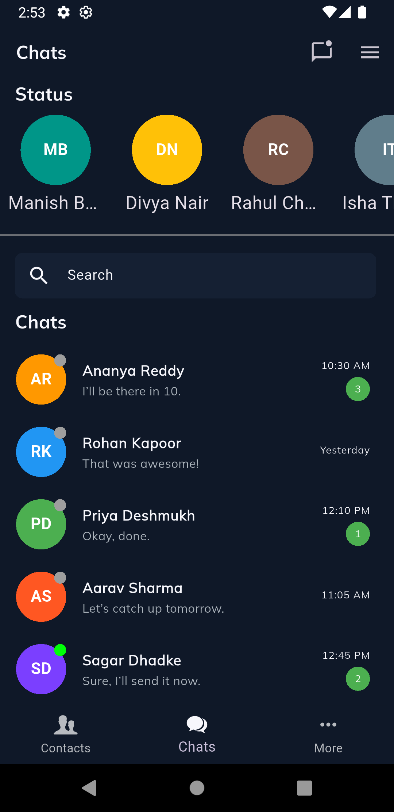
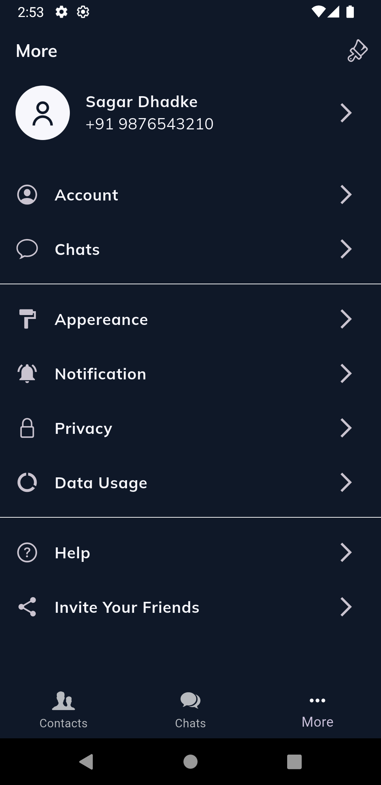

# flutter_chat

A new Flutter project.

## A friendly and modern messaging UI with fast and smooth interactions.

## Apps Screenshots

<table>
  <tr>
     <td>onBoard Light</td>
     <td>Login Light</td>
     <td>Contacts Light</td>
     <td>Chats Light</td>
     <td>More Light</td>
  </tr>
  <tr>
    <td></td>
    <td></td>
    <td></td>
    <td></td>
    <td></td>
  </tr>
 </table>

<table>
  <tr>
    <td>onBoard Dark</td>
     <td>Login Dark</td>
     <td>Contacts Dark</td>
     <td>Chats Dark</td>
     <td>More Dark</td>
  </tr>
  <tr>
    <td></td>
    <td></td>
    <td></td>
    <td></td>
    <td></td>
  </tr>
 </table>